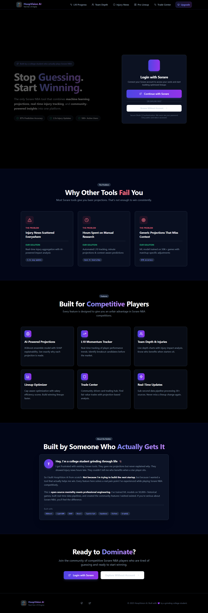

# HoopVisionAI Case Study

HoopVisionAI is a private NBA fantasy analytics web app focused on projection tracking, L10 movement, injury impact, team depth context, and lineup-building workflows.

> This repository is a public case study. It intentionally does not include the production source code, auth flows, billing logic, database access, Supabase functions, pipeline scripts, credential IDs, or private integration details.

## Live Project

- Deployed app: https://hoopvisionai.com
- Full source: private for security

## Screenshot

This screenshot is captured from the deployed website, not from generated mock UI.



## What The Product Does

HoopVisionAI is designed for competitive Sorare NBA-style decision making:

- L10 momentum tracking
- projection and upside analysis
- injury news impact analysis
- team depth context
- lineup optimization concepts
- trade center / value comparison concepts
- Sorare account connection flow
- subscription-gated feature concepts

## Tech Stack

### Frontend

- React
- TypeScript
- Vite
- Tailwind CSS
- shadcn/ui

### Private Backend/Data Workflow

- Supabase
- Python data pipeline
- sports data ingestion
- projection model workflow
- private auth and integration logic

## Sanitized Architecture

```text
React web app
      |
      v
Private data layer
      |
      v
Projection and injury-analysis pipeline
      |
      v
Sports data and fantasy integrations
```

The production repository remains private because it contains sensitive operational details, auth integration, billing integration, pipeline logic, database access, and external provider workflows.

## What I Learned

- Building analytics tools around real user decision workflows
- Connecting model output with UI that explains context and tradeoffs
- Treating authentication, billing, and data pipelines as sensitive systems
- Presenting a deployed project publicly without exposing private internals

